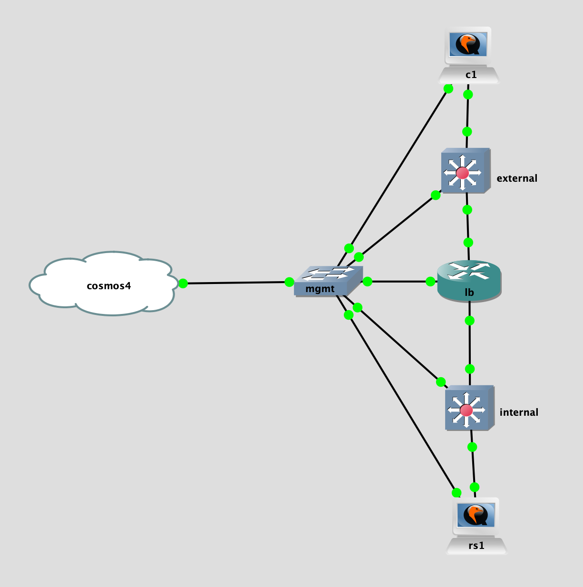

## Topology

## LAB Facts

- lab is created to test a10 static routes and load balancing
- lb has static route to `internal` & default static route to `external`
- `lb` load balance the traffic received on VIP from client and send it to real-server
- below are connectivity test in this lab:
  - tpc/80: LB has been configured so packet from client will reach to real-server
  - tpc/8080: LB has not been configured so packet from client will be dropped by load-balancer
