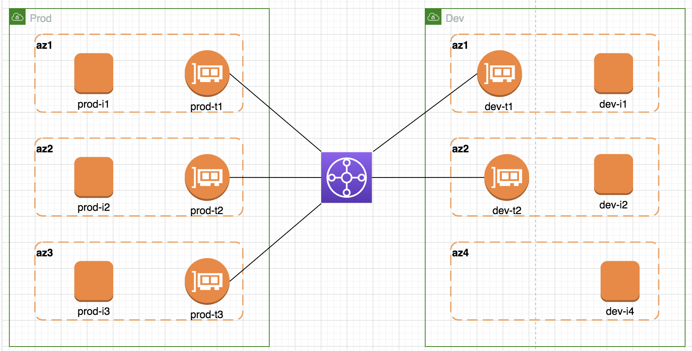

# Topology

# Lab Facts

- This lab is created to understand TGW behavior with multiple AZ intra-region setup
- **Setup**
  - vpc prod
    - jump subnet (for mgmt access to all instances in vpc)
    - three AZ with instance and TGW attachment interface being in separate subnet in each AZ
    - az3 is only available in vpc prod
  - vpc dev
    - three AZ with instance and TGW attachment interface being in separate subnet in each AZ
    - az4 does not have tgw attachment so it will be only accessible locally
- **Behavior Summary**
  - When sender AZ available on both side of the tgw, receiver AZ will be decided by sender AZ
  - When sender AZ is available only on one side of the TGW, receiver AZ will be randomize
  - When receiver AZ is not attached to TGW, incoming traffic to that AZ will be delivered successfully in forward direction. Return traffic will not be initiated because of the absence of tgw attachment
  - TGW and TGW attachment interfaces behaves like router and it's connected interfaces

**Note:** Take a look at below doc for logs & detailed information https://docs.google.com/spreadsheets/d/1FUaSt125TKBG6dkf0uy4rXh3brT31PEa8ohWLdJxFHc/edit#gid=108573899
