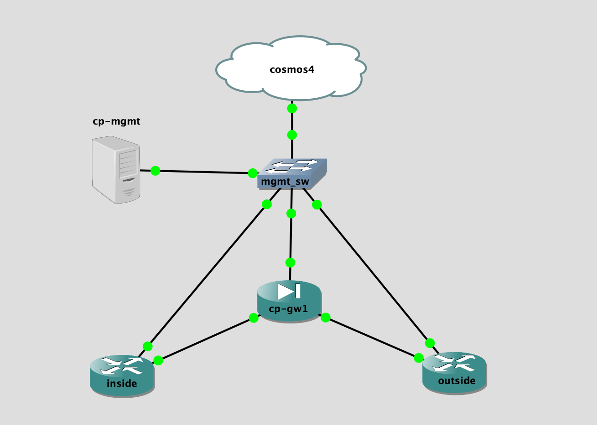

## Topology

## LAB Facts

- checkpoint lab with gateway and management server
- four devices:
  - cp-mgmt
  - cp-gw1
  - inside
  - outside
- policy resides in `cp-mgmt` and getting pushed to `cp-gw1`. `inside` & `outisde` running ospf with `cp-gw1`
- policies:
  - ospf multicast and mgmt traffic is allowed
  - deny `icmp` from inside to outside
  - allow `ssh` from inside to outside
