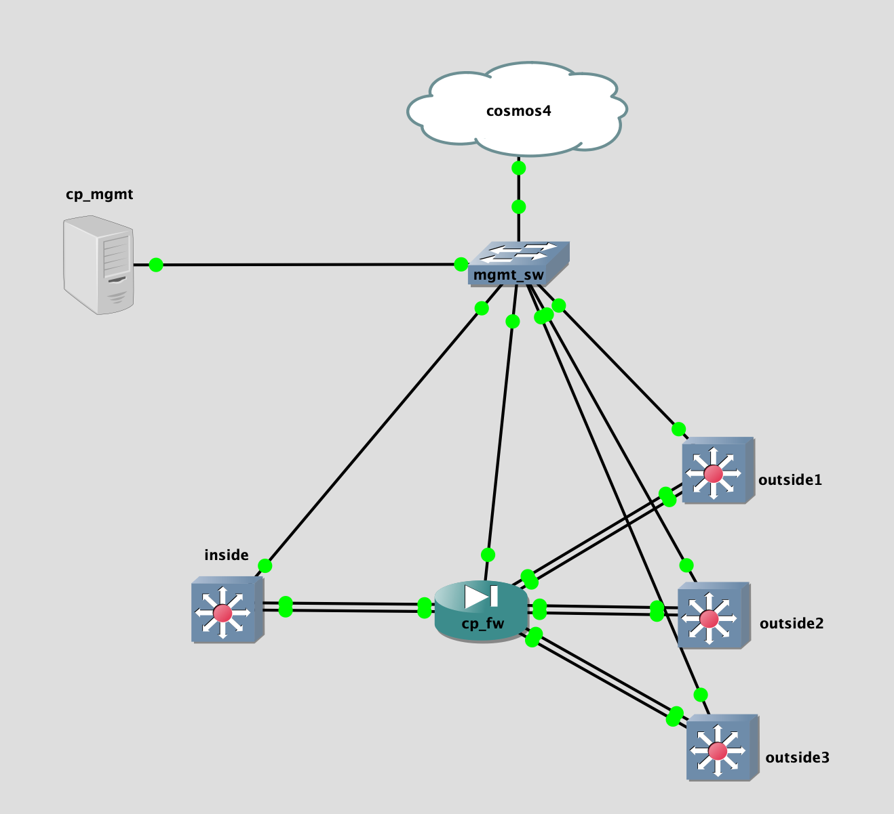

## Topology

## LAB Facts

- checkpoint lab to test the bond and vlan interfaces
- cp_fw is conneected to different NXOS devices which represent the bond/vlan scenarios
  - inside, cp_fw, outside1: normal working scenario using bond34, L2 vlan 3
  - inside, cp_fw, outside2 & inside, cp_fw, outside3: common L2 vlan working secnario. L2 vlan 4 being used by bond56 & bond78 going to outside2 & outside3
- fw policy: policy allow only 10/8(source/destination), deny everthing else.
  - inside(10.12.2.1) can ping outside1(10.23.3.2) but can't ping outside1(172.16.0.3)
  - inside(10.12.2.1) can ping outside2(10.24.4.2)
  - inside(10.12.2.1) can ping outside2(10.25.4.2)
