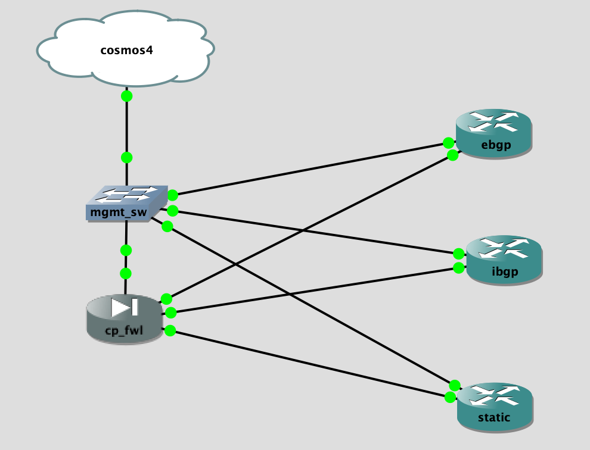

## Topology

## LAB Facts

- first checkpoint lab with only security gw(checkpoint fw)
- cp_fwl(checkpoint fw) is conneected to different Cisco IOS devices(ebgp, ibgp, static) which represent the routing scenarios
- cp_fwl advertises `192.168.123.1` to ebgp and ibgp and it has staic route towards device static for ip `192.168.123.5`
