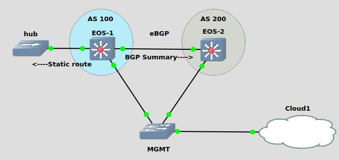

### LAB Facts:

This lab was designed to understand the interaction between BGP aggregates and other types of routes.
Especially to undarstand the BGP aggragation behavior when other routes are present in Routing table.

1. EOS-1 and EOS-2 are eBGP peers.
2. EOS-1 has 7 static routes in its IPv4 Table.
   10.10.1.0/24
   10.11.0.0/16
   10.11.1.0/24
   10.12.0.0/16 254
   10.12.1.0/24
   10.13.0.0/16 199
   10.13.1.0/24
   \*\* The trailing numbers 254 & 199 are the Administrative distance(AD).
3. EOS-1 is generating aggregate routes as:
   10.10.0.0/16
   10.11.0.0/16
   10.12.0.0/16
   10.13.0.0/16
4. BGP only aggregate Networks in it's BGP table are:
   10.10.0.0/16
   10.12.0.0/16
5. The networks 10.11.0.0/16 and 10.13.0.0/16 are not aggregated.

Conclusion:
If you have a static route with prefix-length /16 in the routing table, BGP can't aggregate the same route as /16.
Because the AD of the static route is 1 (Routing-table) and BGP local-aggregate AD is 200. The Lower AD is preferred.
So, only 10.10.0.0/16 and 10.12.0.0/16 are aggregated.
