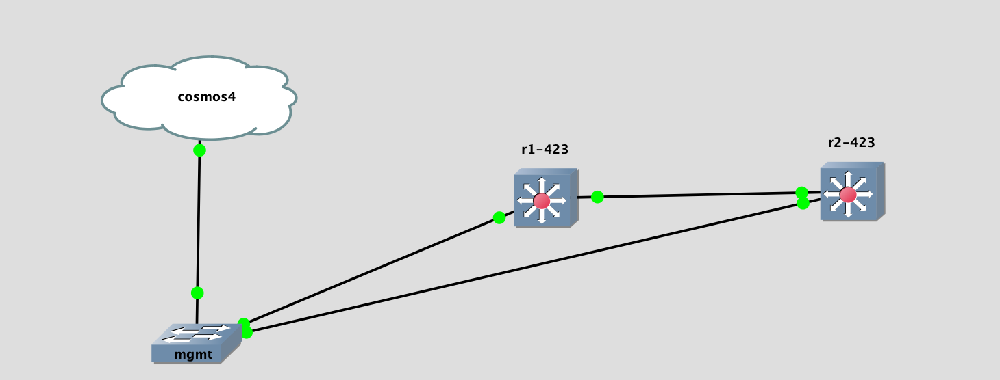

## Topology

## LAB Facts

- Lab is created to understand bgp weight & path selection with multi agent configuration
- `r1` & `r2` both have local routes `172.16.12.1/32 & .2/32`. Both also advertises these routes to each other
- While receiving, `r1` increases `weight` for route `172.16.12.2/32` to `32769` and it will be valid best in BGPRIB vs local route.
- `r1` will also not going to advertise `172.16.12.2/32` to `r2` because it has valid best route received from `r2`
