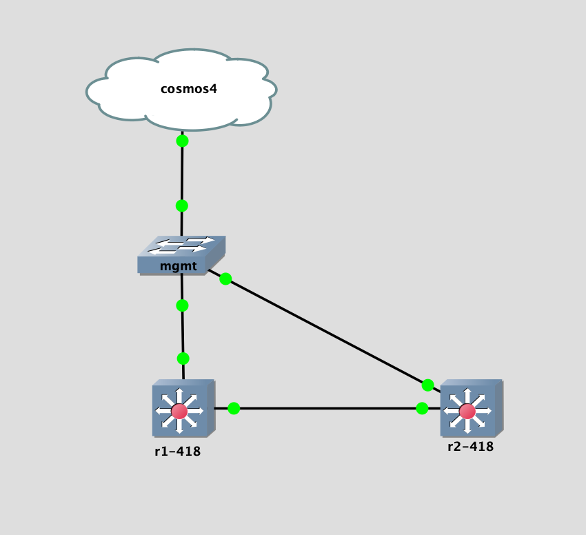

## Topology

## LAB Facts

- Lab is created to understand bgp weight & path selection with ribd(single-agent) configuration
- `r1` & `r2` both have local routes `172.16.12.1/32 & .2/32`. Both also advertises these routes to each other
- While receiving, `r1` increases `weight` for route `172.16.12.2/32` to `32769` but it will not be valid best in BGPRIB because in ribd(single-agnet) config local/redistrubuted will get preference before weight
- so basically, both `r1 & r2` will advertises route `172.16.12.1/32 & .2/32` to each other but valid best will be the local routes
