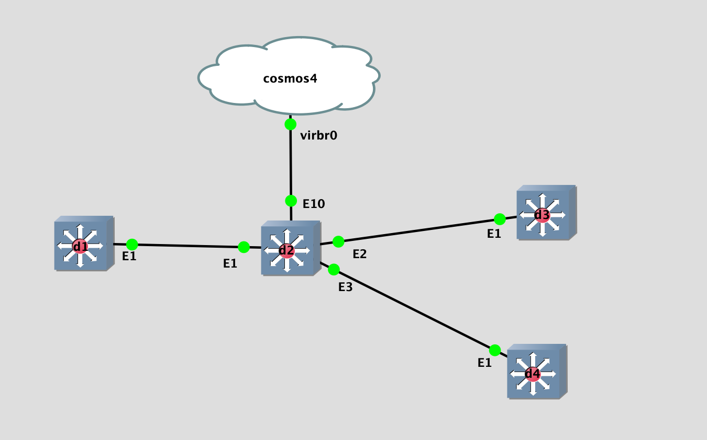

## Topology

## LAB Facts

- Lab is created to understand the `ebgp loop prevention` in `EOS`
  - D1 advertises two routes(192.168.123.1/32, 92.168.123.222/32) to D2
  - While receiving, D2 prepand `222` to `192.168.123.222/32`. `192.168.123.222/32` is unchanged.
  - Based on configuration of `D2 & peer`, routes(`192.168.123.1/32 & 192.168.123.222/32`) will be accepted/rejected/not_sent. On D2, each peer is representing one scenario like below where D2 is sender and peer is reciever:
    - D2 & D3: D2=default, D3=default
      - D2 will advertise both routes to D3. D3 will reject it because of AS-PATH
    - D2 & D4: D2=Default, D4=allowas-in
      - D2 will advertise both routes to D4. D4 will accept it because of allowas-in on D4

## Observation

- Sender
  - Default: Send routes to peer irrespective of their AS-PATH
- Receiver
  - Default: Rejects the routes if ASN is available in AS-PATH
  - allowas-in: Accepts the routes even though ASN is available in AS-PATH
- Questions:
  - Does bgp peer send a route back to the sender?
    - NO, Does not send route back to the advertising AS

Doc link: [EBGP Loop Prevention Summary](https://docs.google.com/document/d/1lWdwEuEqJTxF746HI6omcRE6ZJq_XQ-XoPKgjOR22BQ/edit#)
