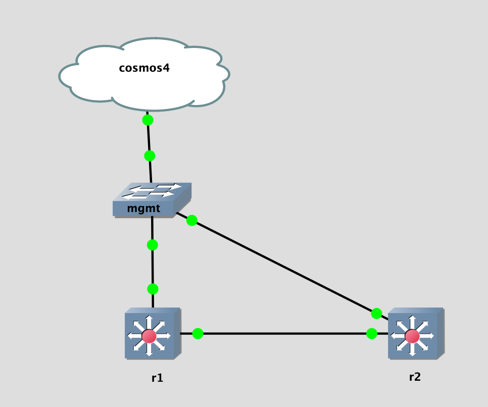

## Topology

## LAB Facts

- Lab is created to understand ibgp local-preference behavior while redistributing local routes in BGPRIB
- `r1` & `r2` has ibgp peering
- `r1` redistributes local routes as follow and send it to `r2`:
  1. `172.16.1.1/32` with defalt setting.
  2. `172.16.1.2/32` with LP 5
  3. `172.16.1.2/32` with LP 0

## Conclusion:

- Arista sets LP 0 by default and will be changed to 100 when it sends to peer
- When we change LP manually(see 2 & 3), it will be preserved
