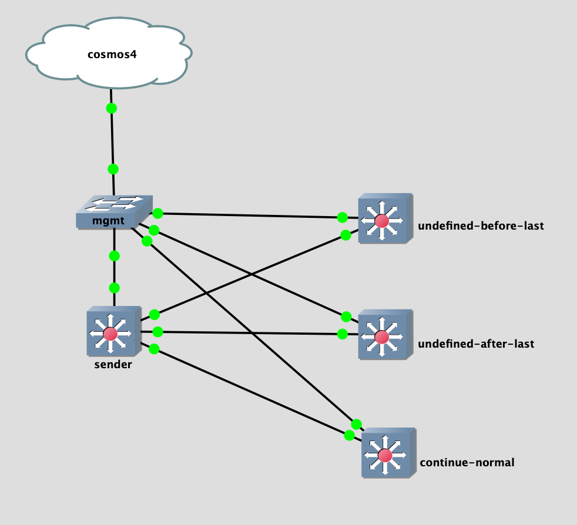

## Topology



## LAB Facts

- lab is created to understand `continue` usage in route-map in Arista EOS
- lab has four devices with ebgp peering
  - sender: sends route to all three neighbor
    - `172.16.0.1` --> `undefined-before-last`
    - `172.16.0.2` --> `undefined-after-last`
    - `172.16.0.3` --> `continue-normal`
  - undefined-before-last
    - receives `172.16.0.1`.
    - match on sequence 10, prepand ASN 10
    - continue to 30(which is not defined). last sequence is 40
  - undefined-after-last
    - receives `172.16.0.2`.
    - match on sequence 10, prepand ASN 10
    - continue to 100(which is not defined). last sequence is 40
  - continue-normal
    - receives `172.16.0.3`.
    - match on sequence 10, prepand ASN 10
    - continue to 30(which is defined), ASN will not be prepanded because of no match
    - will move on to sequence 40, prepand ASN 40

## Observation

- When `continue` is defined, batfish aligns with real device
- When `continue` is undefined, batfish does not allow routes. Real device takes configured action and ignores the undefined sequence number.
- Real device does not allow loop(20->30->20) while using `continue` sequences. It displays below error regarding `loop` and will not allow to use `continue` statement. On the other hand, batfish accept this config and do not allow any routes.

```
route-map test1 permit 10
    set as-path prepend 10
route-map test1 permit 20
    continue 10
% Loop in the routemap
```
