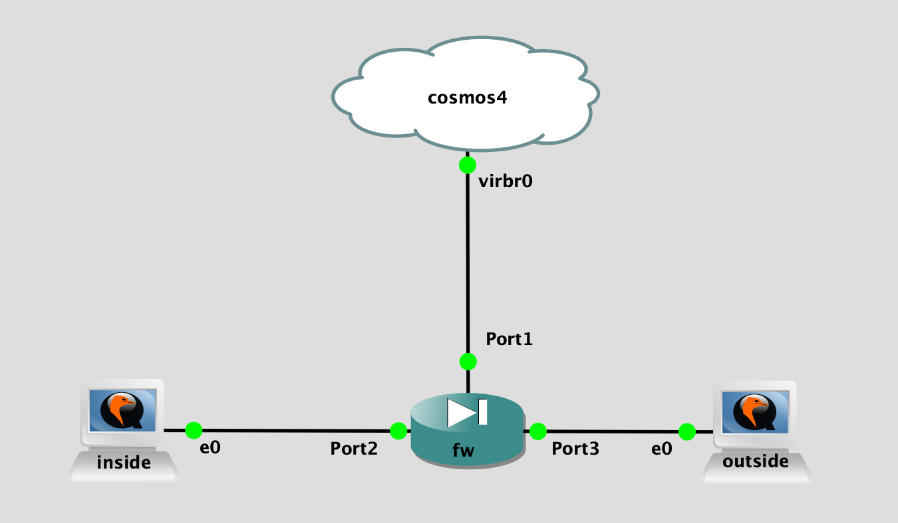

## Topology

## LAB Facts

- lab is created to test the connectivity data with fortios firewall
- single firewall connected with inside(which will be client) & outside(which will be server)
- panos fw policy configured as below:
  - ping, ssh - allow
  - tcp/9100 - allow
  - tcp/9101 - deny
  - udp/9200 - allow
  - udp/9201 - deny
