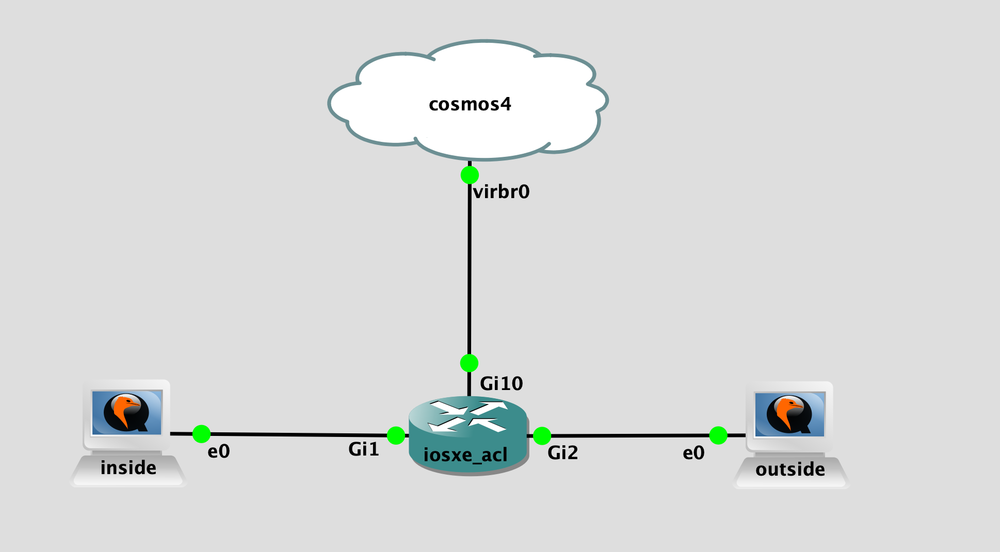

## Topology

## LAB Facts

- lab is created to test the connectivity data with iosxe firewall
- iosxe is configured with ACL & connected with inside(which will be client) & outside(which will be server)
- ACL is configured as below:
  - ping, ssh - allow
  - tcp/9101 - deny
  - tcp/9100-9199 - allow
  - udp/9201 - deny
  - udp/9200-9299 - allow
  - udp/9202 - deny(return traffic with acl named CONNECTIVITY_IN)
