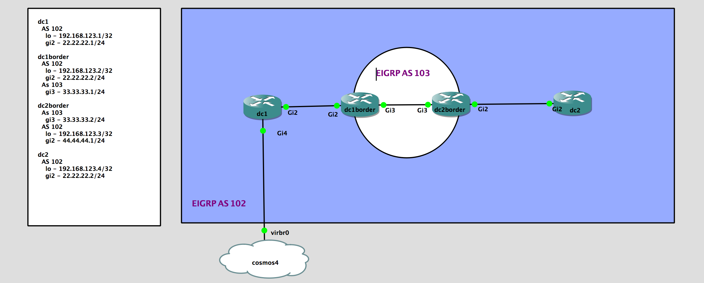

## LAB Facts

- This lab is created to understand the redistribution between different EIGRP process in Cisco IOSXE
- We have four devices in this lab with two EIGRP process(102, 103)
- `AS 103` is running between `border` routers and they are doing the redistribution between two EIGRP process
- `dc1` & `dc2` are running with `AS 102` separated by `AS 103`

## Lab Topology

