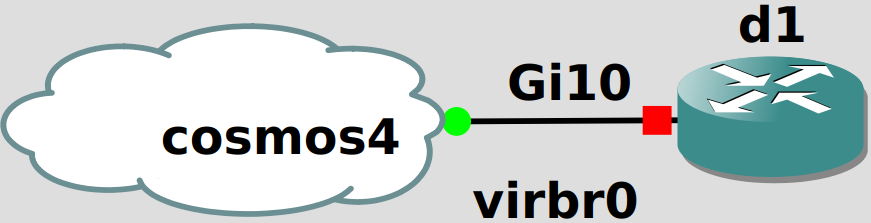

## Topology

## LAB Facts

This lab covers vrf export filtering on a single Cisco IOS-XE device. The setup is based on the device configuration from this [article](https://packetlife.net/blog/2013/sep/26/vrf-export-maps/). Note that the IOS dialect in the article does not match the lab, so adjustments had to be made. In particular, export maps must be applied within a vrf address-family on IOS-XE.

### Setup

- Each VRF represents a network. For simplicity, the prefixes all originate on the single device and are exchanged via `router bgp` -> `redistribute connected`
- There are two customer VRFs, and two corresponding customer colo VRFs.
- There is a services VRF the others are connected to.
- Customer 1 has a prefix that should not be leaked to the services VRF, but should be leaked to its colo VRF
  - The prefixes to be leaked to the services VRF are all in 10.0.0.0/8
  - Customer 1's internal prefix is 172.16.0.0/16
  - Customer 1 prevents leaking of its internal prefix via an export map that removes the configured export route-target that the services VRF imports.
- All other prefixes should be exchanged with the services VRF with appropriate route-targets.
- All leaked prefixes should be part of the vpnv4 address family.
