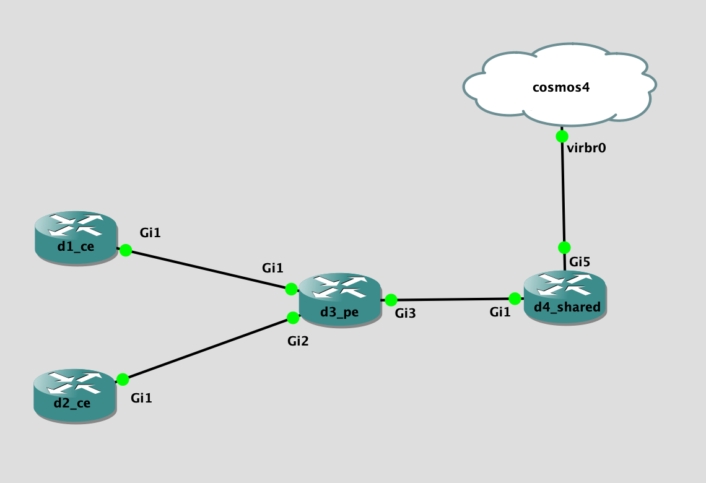

## Topology

## LAB Facts

- Lab is created to understand the `vrf route leaking` in `cisco ios` with `eigrp` wide metric. On high level this lab covers
  - eigrp peering with `wide` metric (between `ce & pe`)
  - vrf leaking `export-map`
  - vrf leaking `import-map`
- 4 devices
  - `d1_ce`
    - `192.168.123.1/32`
  - `d2_ce`
    - `192.168.123.2/32`
  - `d3_pe`
    - `192.168.123.3/32`
    - vrf
      - `d1_ce, d2_ce, d4_shared`
      - nothing is in default vrf
  - `d4_shared`
    - shared subnet `192.168.122.0/24`
    - `192.168.123.4/32`
- Main points
  - `pe` is doing the `vrf route leaking` in such a way that
    - Both `ce` can get to the `shared` subnet `192.168.122.0/24`
    - `ce` can not reach to each other i.e. `192.168.123.1/32 & 192.168.123.2/32`
  - on `d3_pe`
    - vrf `ce1` uses `import map` to import only shared prefix i.e. `192.168.122.0/24`. Prefix `192.168.123.4/32` will not make in
    - vrf `ce2` uses `export map` to deny `2.2.2.2/32` by setting the `RT 2:2`. `2.2.2.2/32` will not make entry into `d4_shared`
