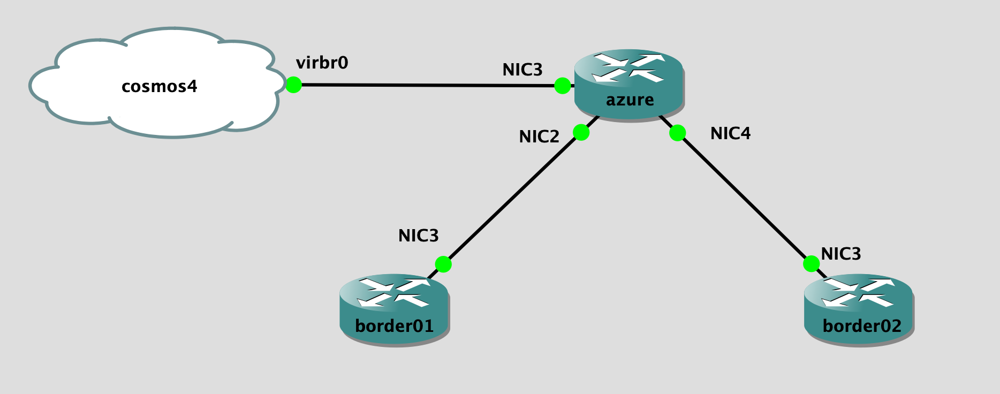

## Topology

## LAB Facts

- lab is created for iosxr ebgp
- three devices: azure, border01, border02
- routes
  - border01 to azure: border01 sends out `192.168.123.2/32` to azure
  - azure to border01: border01 receives `10.77.128.0/17(ASN: 65300 65300) & 10.77.128.0/17(ASN: 65300)` with
  - border02 to azure: ebgp is up but routes will not get exchange since ebgp block route exchange without explicit allowed route-policy. border02 does not have allowed route-policy
