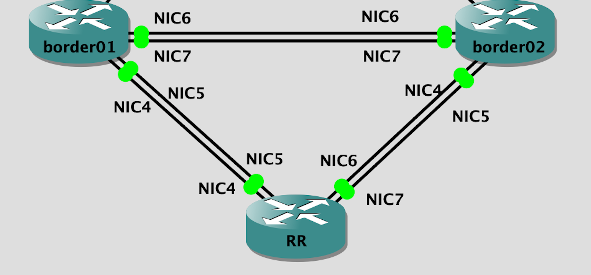

## Topology

## LAB Facts

- lab is created for iosxr ibgp
- three devices: RR, border01, border02
- RR is route-reflector exchange routes between border01 & border02 via ibgp
- ibgp is built over ospf as an igp
- routes
  - border02 to border01: sends `192.168.123.3`
  - border01 to border02: sends `192.168.123.2`
