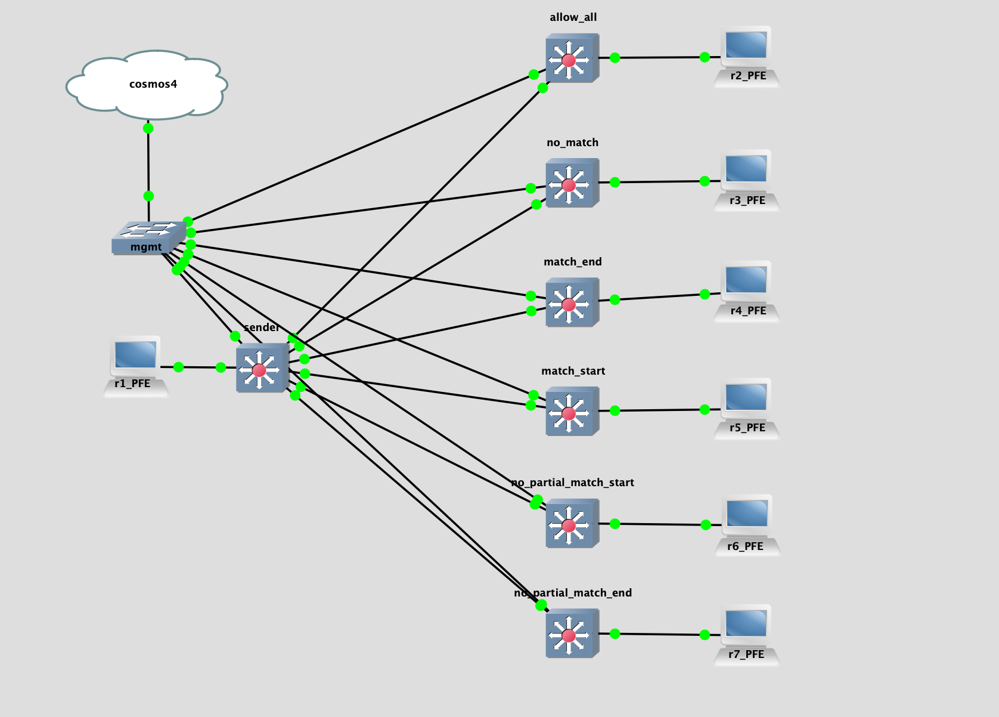

## Topology

## LAB Facts

- Lab is created to ASPATH ACL behavior in JUNOS
- `sender` sends routes:
  - `172.16.1.1/32` without any prepend so ASN will be `65100`
  - `172.16.1.2/32` with ASN prepend `65102` so ASN will be `65102 65100`
- There are total six scenario that we are testing
  - allow_all: match all route. config line is `set policy-options as-path ALLOW_ALL .*`
  - no_match: match no route using unrelated ASN. config line is `set policy-options as-path NO_MATCH .*11111`
  - match_end: match route that ends with ASN 65100. config line is `set policy-options as-path MATCH_END .*65100`
  - match_start: match route that starts with ASN 65102. config line is `set policy-options as-path MATCH_START 65102.*`
  - no_partial_match1: check that partial ASN match is not allowed at start. config line is `set policy-options as-path NO_PARTIAL_MATCH_START .*100`
  - no_partial_match2: check that partial ASN match is not allowed at end. config line is `set policy-options as-path NO_PARTIAL_MATCH_END 65.*`
