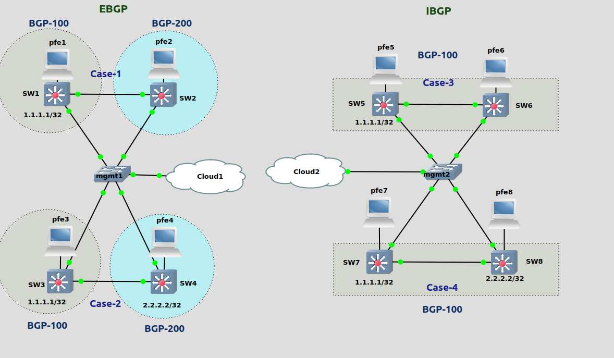

### Lab is to test the impact of `system default-address-selection` on the local-address picked for BGP sessions

There are 4 pairs of routers: SW{1,3,5,7} peer respectively with SW{2,4,6,8}. In all the first set of routes are configured with fixed local-address as 10.1.1.1 (em3) and in passive mode; and the second set of routers are configured without local-address and default-address-selection is ON.

- Case-1 (EBGP singlehop): SW2 has no `lo0`
- Case-2 (EBGP singlehop) : SW4 has `lo0` with address 2.2.2.2/32
- Case-3 (IBGP): SW6 has no `lo0`
- Case-4 (IBGP): SW8 has `lo0` with address 2.2.2.2/32

Findings: When default-address-selection is set (and local-address is not pinned)

- EBGP single hop
  - address is picked based on the neighbor address
- IBGP (and presumably EBGP multihop):
  - if lo0 is present and has a valid address, use that
  - otherwise, use the primary address of the [primary interface](https://www.juniper.net/documentation/us/en/software/junos/interfaces-fundamentals/topics/ref/statement/primary-edit-interfaces-family.html)
  - does not pick the local-address based on the neighbor address
