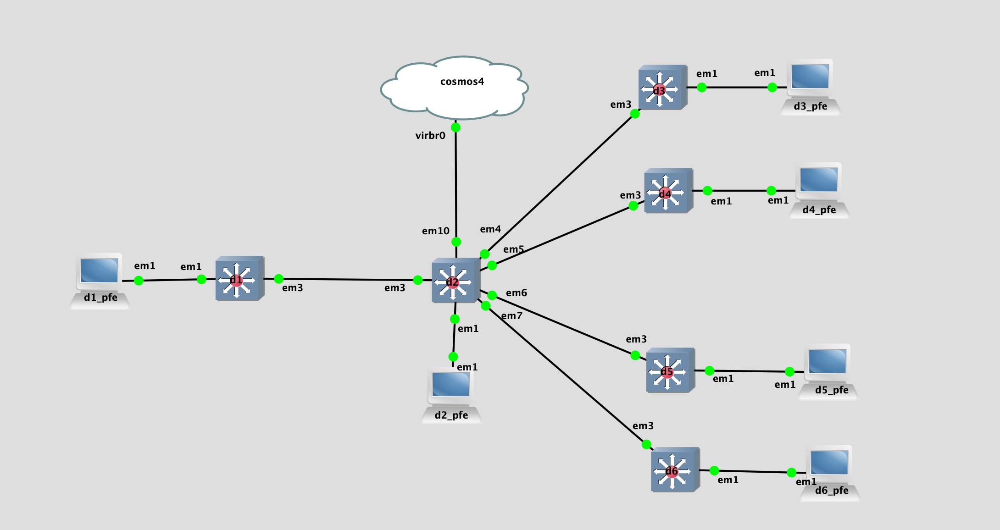

## Topology

## LAB Facts

- Lab is created to understand the `ebgp loop prevention` in `Junos`
  - D1 advertises two routes(192.168.123.222/32` & 192.168.123.222/32`) D2
  - While receiving, D2 prepand `222` to `192.168.123.222/32`. `192.168.123.222/32` is unmodified.
  - Based on configuration of `D2 & peer`, routes(`192.168.123.1/32 & 192.168.123.222/32`) will be accepted/rejected/not_sent. On D2, each peer is representing one scenario like below where D2 is sender and peer is reciever:
    - D2 & D3: D2=default, D3=default
      - D2 will advertise only `192.168.123.222/32` to D3 as it does not have first/most-recent ASN 65001. D3 finally will reject it
    - D2 & D4: D2=default, D4=loops 2
      - D2 will advertise only `192.168.123.222/32` to D4. D4 will accept it
    - D2 & D5: D2=advertise-peer-as, D5=default
      - D2 will advertise both routes to D5. D5 will reject it
    - D2 & D6: D2=advertise-peer-as, D6=loops 2
      - D2 will advertise both routes to D6. D6 will accept it

## Observation

- Sender
  - Default:
    - peer ASN is present first/most-recnet in AS-PATH: do not send routes to peer
    - peer ASN is not present first/most-recnet in AS-PATH: send routes to peer
  - Advertise-peer-as: send routes to peer even though the ASN is same as sender. ASN location does not matter in AS-PATH
- Receiver
  - Default: Discard the routes if route has receiver ASN in AS-PATH
  - Loops: Accept the route with receiver ASN in AS-PATH restricted to Loops value
- Questions:
  - Does bgp peer send a route back to the sender?
    - NO, Does not send route back to the advertising AS
