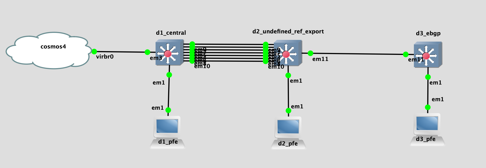

## Topology

## LAB Facts

- This lab is created to understand the undefined prefix-list behaviour with Junos export direction
- There are three devices: d1, d2_export, d3_ebgp
- Unlike other vendor, Junos has three different level where we can define reference
  - peer level
  - peer group level
  - global level
- 7 ebgp peering is running between `d1 & d2` which represent below 7 scenarios for in(import) testing
  - p-level defined, p = peer level
  - p-level undefined
  - pg-level defined, pg = peer group level
  - pg-level undefined
  - g-level defined g = global level
  - g-level undefined
  - p-pg-g-level defined
- Added `d3_ebgp` device to see how `d2` advertise the bgp routes received from `d3` vs generated by it self.
- `1st bgp peering` sends prefix `172.16.1.1/32` from `d1` to `d2` and then `d2` evalute using `prefix-list`. Same thing will happen for rest of the 6 peering; e.g. 2nd peering = `172.16.1.2/32`, 3rd peering = `172.16.1.3/32` and so on.

## Observation

- Reference will be prefeered in order of peer-level, peer-group level, global level i.e. peer-level reference will be prefered over others.
- When there is `undefined reference`, route policy will follow the action based on `defaul route policy` of protocol. For this lab we have used BGP so defaul policy action for BGP would be
  - Import: Accept all routes learned from BGP neighbors
  - Export: Export all active bgp routes learned via BGP to all BGP neighbors. Examples are
    - `d2` advertises prefix `192.168.123.3/32`(originated by `d3`) to `d1` via all 7 peering because:
      - `d2` has active bgp route received from `d3`
    - `d2` does not advertise prefix `172.16.2.2/32` to `d1` because:
      - It is directly connected route from `d2` point of view i.e. not a active bgp route
      - reference is not defined for the prefix
