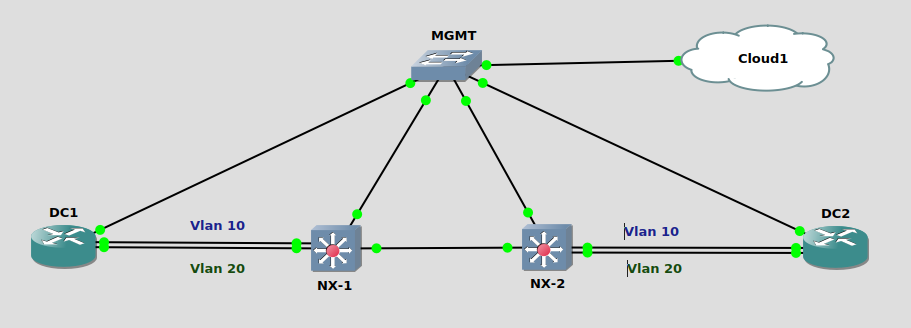

### Topology

### LAB Facts:

The lab is created to test the L2VNI on NXOS

1. Lab is basic EVPN with BGP
2. There are 4 Devices NX-1, NX-2, DC1 & DC2.
3. NX-1 & NX-2 have a static route pointing towards each other's loopback0.
4. IBGP peering is on loopback0 and AS no. is 65001
5. Both have vlan 10 & 20 configured as VxLAN EVPN with L2VNI 5010 & 5020.
6. The DC1 & DC2 are used to generate traffic for vlan 10 & 20.
