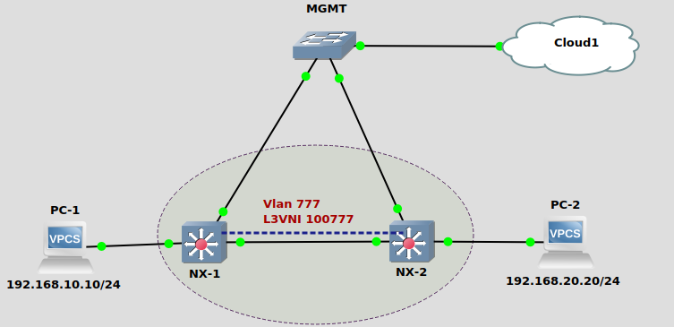

### Topology

### LAB Facts:

The lab is created to test the EVPN Type-5 routes using L3VNI on NXOS.
• 2 Devices with IBGP peering NX-1 & NX-2.
• No Vlans or L2VNIs are created.
• PC-1 & PC-2 are connected to NX-1 & 2 respectively.
• There is a L3VNI (100777) created with Vlan-777.
• A vrf TENANT-777 is created attached with L3VNI (100777) and is associated with "int Vlan-777 (VTEP)" & "BGP".
• Vrf TENANT-777 is used as a Gateway for both PC.
• A "route-map all", permitting all traffic, is redistributed in BGP.
• Only route-type 5 present in BGP EVPN.
