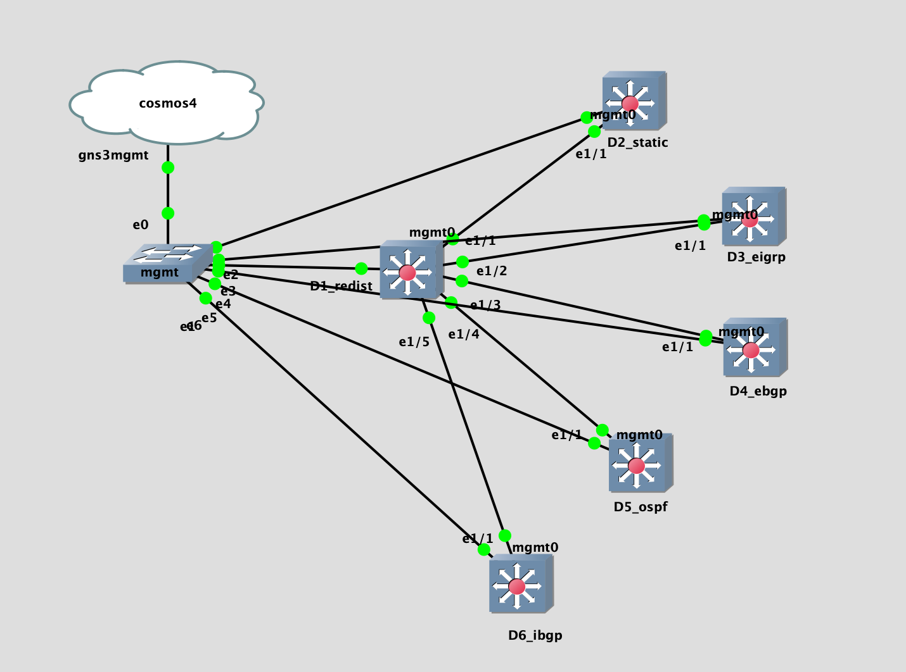

## LAB Facts

- This lab is created to understand the redistribution between different routing protocols in Cisco NXOS
- There are 6 devices d1 to d6.
- Each device represents one routing protocol i.e. `d3_eigrp` represent the the `EIGRP` routing protocol
- `d1_redist` is the central device where all other devices connects as an neighbor and redistribution is happening between all protocols
- Testing the redistribution for following protocols
  - connected
  - static
  - eigrp
  - ebgp
  - ospf
  - ibgp
- Redistribution is restricted with `route-map`

## Lab Topology

