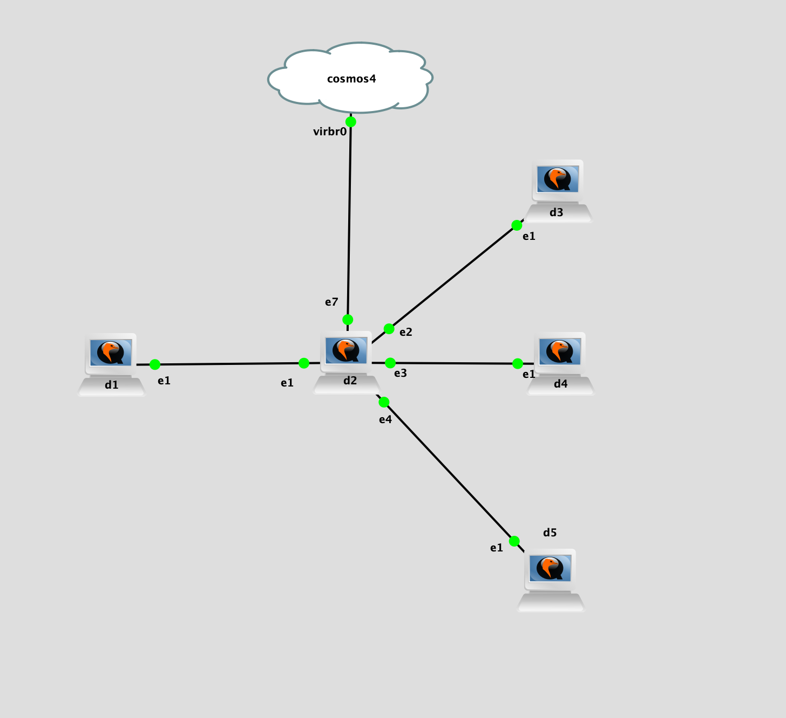

## Topology

## LAB Facts

- Lab is created to understand the `ebgp loop prevention` in `panos`

  - `d1` advertises route(`192.168.123.2/32`) to all peers `D2`
  - Based on the bgp peer configuration on D2, route will be accepted/rejected/not_sent
    - D2 does not advertise route to D3
      - D1 advertises route(192.168.123.1/32) to D2. D2 does not advertise it to D3 because sender-side-loop-detection is ON. This is the default scenario.
    - D2 advertises route to D4
      - D1 advertises route(192.168.123.1/32) to D2. D2 advertises it to D4 because sender-side-loop-detection is OFF. D4 rejects those routes because its own ASN is available in AS-PATH
    - D2 advertises route to D5 by removing ASN 65001
      - D1 advertises route(192.168.123.1/32) to D2 after removing ASN 65001 from the AS-PATH. D2 advertises it to D5 because sender-side-loop-detection is OFF. D4 accept it because its own ASN is not available in AS-PATH

- Setup: 5 devices
  - D1
    - Sends route 192.168.123.1/32 to D2
    - ASN: 65001
  - D2
    - Receives route 192.168.123.1/32 from D1 and send/do not send to D3, D4, D5 based on configuration
    - ASN: 65002
    - D1: Enable-sender-side-loop-detection: None
    - D3: Enable-sender-side-loop-detection: Yes
      - Do not send route to peer because sender-side-loop-detection is Yes
    - D4: Enable-sender-side-loop-detection: No
      - Do send route to peer because sender-side-loop-detection is Yes, Receiver will reject it because of its own ASN is available in AS-PATH
    - D5:
      - Enable-sender-side-loop-detection: No
      - Remove as 65001 from the AS-PATH
        - Do send route to peer because sender-side-loop-detection is Yes, Receiver will reject it because of its own ASN is available in AS-PATH
  - D3
    - ASN: 65001
  - D4
    - ASN: 65001
  - D5
    - ASN: 65001

## Observation

- **Sender**
  - enable-sender-side-loop-detection=Yes: Do not send routes if peer ASN is available in AS-PATH. This is default value i.e. if neighbor does not have explicit config line related to sender-loop-detection than consider this value yes
  - enable-sender-side-loop-detection=No: Do send routes irrespective of the `AS-PATH` valueH
- **Receiver**
  - Default: receives and rejects the routes if ASN is available in AS-PATH
  - There is no setting on the receiving side like allowas-in which we have for other vendors(yet 02/03/2021). If we want to allow routes in, sender has to make sure ASN in not in the AS-PATH before sending it
