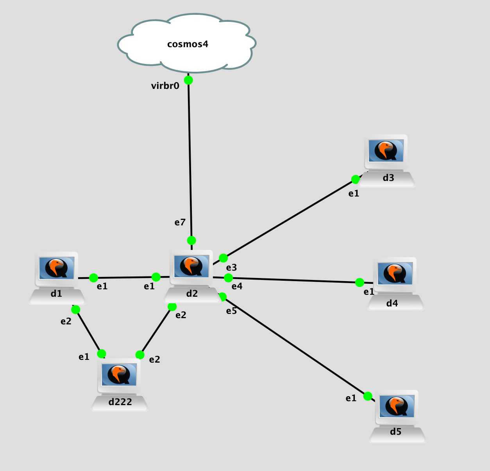

## Topology

## LAB Facts

- Lab is created to understand the `ebgp loop prevention` in `PANOS`
  - D1 advertises two routes:
    - 192.168.123.1/32 to D2
    - 192.168.123.222/32 to D22 to D2(this is to put ASN 222 in AS-PATH like we did for other labs)
  - Based on configuration of `D2 & peer`, routes(`192.168.123.1/32 & 192.168.123.222/32`) will be accepted/rejected/not_sent. On D2, each peer is representing one scenario like below where D2 is sender and peer is reciever:
    - D2 & D3: D2=default, D3=default
      - D2 will not advertise any routes as by default sender-side-loop-detection is ON.
    - D2 & D4: D2=sender-side-loop-detection=No, D4=default
      - D2 will advertise both routes to D4. D4 will reject it because of local ASN in AS-PATH
    - D2 & D5: D2=sender-side-loop-detection=No + remove AS 65001 before sending out to D5, D5=default
      - D2 will advertise both routes to D5. D5 will accept it

## Observation

- Sender
  - enable-sender-side-loop-detection=Yes: Default behavior. Do not send routes if peer ASN is available in AS-PATH. ASN location does not matter in AS-PATH
  - enable-sender-side-loop-detection=No: Do send routes irrespective of the AS-PATH value
- Receiver
  - Default: receives and rejects the routes if ASN is available in AS-PATH
  - There is no setting on the receiving side like allowas-in which we have for other vendors(yet 02/03/2021). If we want to allow routes in, sender has to make sure ASN in not in the AS-PATH before sending it
- Questions:
  - Does bgp peer send a route back to the sender?
    - NO, Does not send route back to the advertising AS

Doc link: [EBGP Loop Prevention Summary](https://docs.google.com/document/d/1lWdwEuEqJTxF746HI6omcRE6ZJq_XQ-XoPKgjOR22BQ/edit#)
