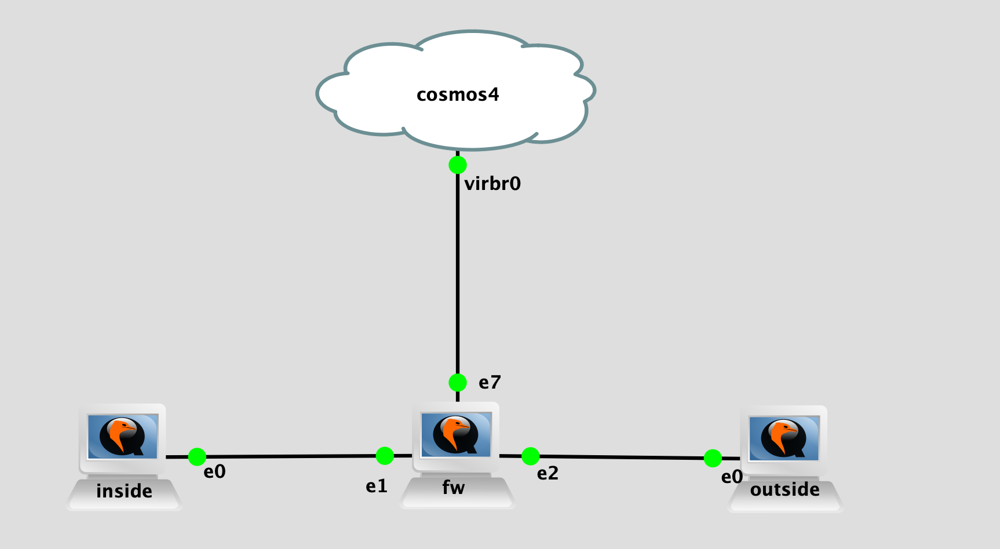

## Topology

## LAB Facts

- lab is created to test the connectivity data with panos firewall
- single firewall connected with inside(which will be client) & outside(which will be server)
- panos fw policy configured as below:
  - ping, ssh - allow
  - tcp/9100 - allow
  - tcp/9101 - deny(initial 4 packets will be allowed and then will start to drop)
  - udp/9200 - allow
  - udp/9201 - deny(initial 4 packets will be allowed and then will start to drop)
- app override is configured for above ports custom tcp and udp ports
- application is not configured with `ports` so that we can simulate the firewall behavior where initial packets will be allowed and then traffic will be denied
