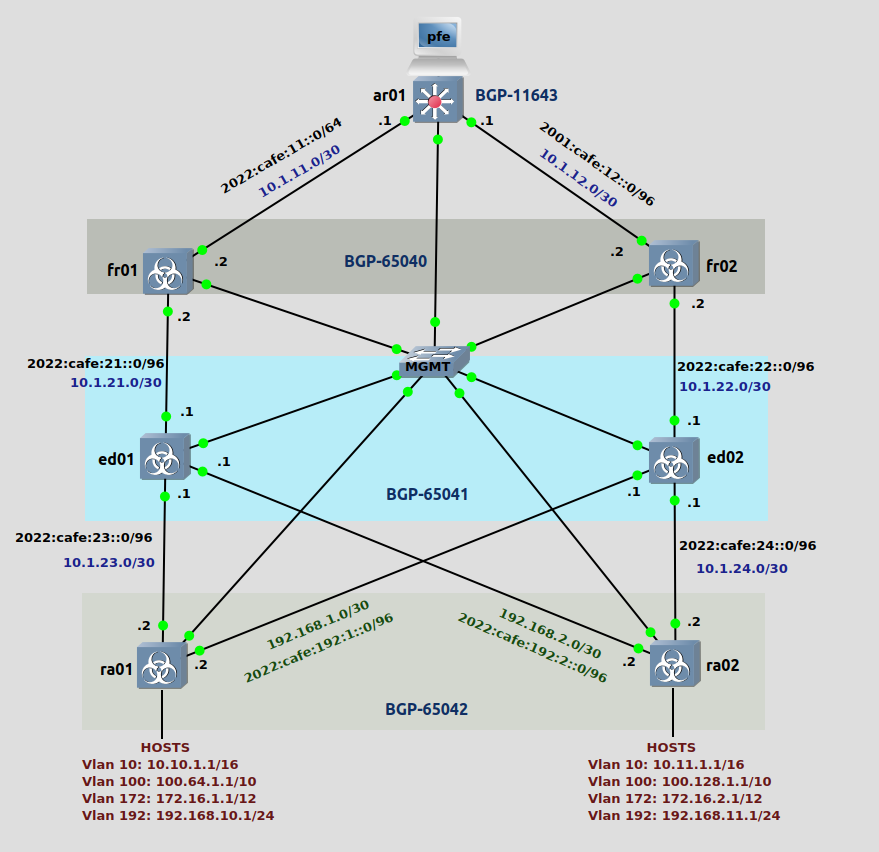

### LAB Facts

1. Lab is created to test/understand the SONiC Switch for BGP IPv4 & IPv6.
2. The ED01 & ED02 are the SPINES. BGP AS 65041.
3. The RA01 & RA02 are the LEAFs, BGP AS 65042.
4. The FR01 & FR02 are the Fabric_Path Switches in BGP AS 65040.
5. The Edge switch is AR01 in BGP AS 11643 and connected to Outside Networks.
6. Traffic to be analyzed coming from AR01 to hosts(vlans) connected to RA01 & RA02.
